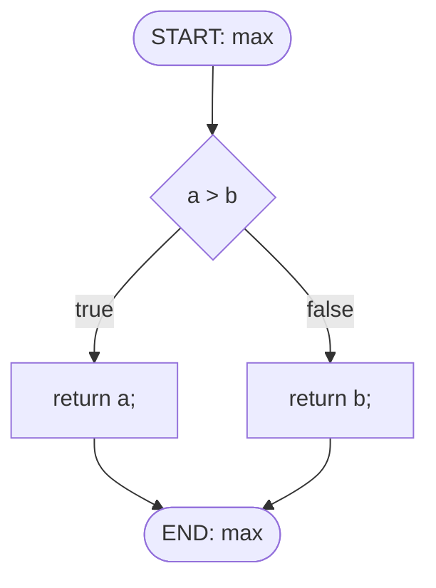

# vFlow
A tool for automatic generation of code-level control flow diagrams

C言語のソースコードから制御フローグラフ（CFG）を自動生成し、Mermaid形式で出力するツールです。

## 📚 ドキュメント

ソースコードを学習したい方は、[docs/](./docs/)ディレクトリのドキュメントをご覧ください：

- **[学習ガイド](./docs/learning-guide.md)**: ソースコードの読み方と学習順序（初心者向け）
- **[基礎知識](./docs/fundamental-concepts.md)**: AST、CFG、tree-sitterなどの詳細解説
- **[クイックリファレンス](./docs/quick-reference.md)**: よく使うコマンドとコードパターン

システムアーキテクチャについては[architecture.md](./architecture.md)を参照してください。

## 🚀 実行手順

### ビルド

```bash
cargo build --release
```

### 実行

```bash
# デフォルトで実行（example_code/ディレクトリを処理）
./target/release/cfg-generator
# Processing: "example_code/example.c" -> "output/example.md"
# Processing: "example_code/test_complex.c" -> "output/test_complex.md"

# 単一ファイルの指定も可能
./target/release/cfg-generator example_code/example.c -o output/test_single.md
```

## 📖 使用例

### 入力 (example.c)
```c
int max(int a, int b) {
    if (a > b) {
        return a;
    } else {
        return b;
    }
}
```

### 出力 (example.md)
関数maxの制御フローグラフをMermaid形式で生成します。



## 🛠️ 技術スタック

- **言語**: Rust
- **パーサー**: tree-sitter (tree-sitter-c)
- **CLI**: clap
- **出力形式**: Mermaid flowchart

## 📝 ライセンス

[ライセンスファイルを参照](./LICENSE)
