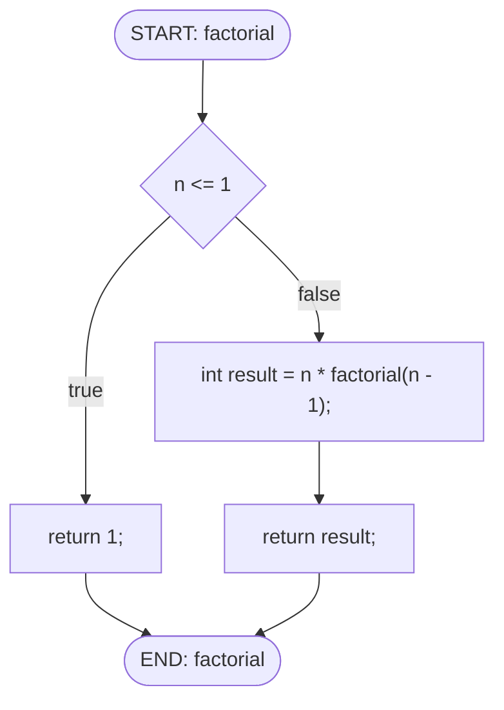

# CFG Generator - C言語制御フロー図生成ツール

C言語のソースコードから制御フロー図（CFG）を生成し、Mermaid形式で出力するツールです。

## 機能

- ✅ 順次実行（単純文）
- ✅ if文（else含む）
- ✅ ネストしたif文
- ✅ 関数の開始・終了
- ❌ ループ（for/while）- 今後実装予定
- ❌ switch文 - 今後実装予定

## 必要な環境

- Rust（1.70以上推奨）
- Cargo

## ビルド方法

```bash
cd cfg-generator
cargo build --release
```

ビルドが成功すると、実行ファイルは `target/release/cfg-generator` に生成されます。

## 実行方法

### 1. デフォルトで実行（最も簡単）

```bash
./target/release/cfg-generator
```

- 入力: `example_code/` ディレクトリ内の全ての `.c` ファイル
- 出力: `output/` ディレクトリに各ファイル名に対応する `.md` ファイル

**実行例:**
```bash
$ ./target/release/cfg-generator
Processing: "example_code/example.c" -> "output/example.md"
Processing: "example_code/test_complex.c" -> "output/test_complex.md"
```

### 2. 入力ディレクトリを指定

```bash
./target/release/cfg-generator <入力ディレクトリ>
```

**例:**
```bash
./target/release/cfg-generator my_c_code
```

### 3. 入力・出力ディレクトリを両方指定

```bash
./target/release/cfg-generator <入力ディレクトリ> -o <出力ディレクトリ>
```

**例:**
```bash
./target/release/cfg-generator example_code -o my_output
```

### 4. 単一ファイルを処理

```bash
./target/release/cfg-generator <入力ファイル.c> -o <出力ファイル.md>
```

**例:**
```bash
./target/release/cfg-generator example_code/example.c -o output/result.md
```

## プロジェクト構造

```
cfg-generator/
├── Cargo.toml
├── README.md
├── src/
│   ├── main.rs           # CLIエントリポイント
│   ├── lib.rs            # ライブラリルート
│   ├── parser.rs         # tree-sitterを使ったCコードパーサー
│   ├── cfg.rs            # CFG構造とビルダー
│   └── renderer.rs       # Mermaid形式での出力
├── tests/
│   └── integration_test.rs  # 統合テスト
├── example_code/         # サンプルCファイル
│   ├── example.c
│   └── test_complex.c
└── output/               # 生成されたCFG（Mermaid形式）
    ├── example.md
    └── test_complex.md
```

## 出力例

### 入力 (example.c)

```c
int factorial(int n) {
    if (n <= 1) {
        return 1;
    } else {
        int result = n * factorial(n - 1);
        return result;
    }
}
```

### 出力 (example.md)



## テスト

```bash
cargo test
```

全てのテストが成功することを確認してください。

## ヘルプ

```bash
./target/release/cfg-generator --help
```

## トラブルシューティング

### ビルドエラー

依存関係の問題がある場合：
```bash
cargo clean
cargo build --release
```

### 出力ディレクトリが存在しない

ツールが自動的に `output/` ディレクトリを作成します。手動で作成する必要はありません。

### Mermaid図が表示されない

生成された `.md` ファイルをGitHub、GitLab、またはMermaid対応のMarkdownビューアで開いてください。

## ライセンス

このプロジェクトの詳細はDESIGN.mdを参照してください。
