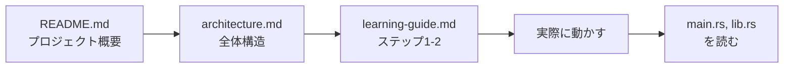
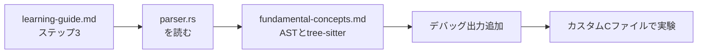
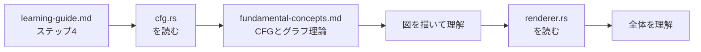
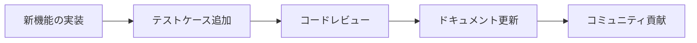

# vFlow ドキュメント

vFlowのソースコードを学習するためのドキュメント集です。

## 📖 ドキュメント一覧

### 1. [学習ガイド](./learning-guide.md) ⭐ **ここから始めよう！**
ソースコードを効率的に学習するための順序と推奨される読み方を解説。

**こんな人におすすめ:**
- vFlowのコードを初めて読む人
- どこから読めばいいか分からない人
- 体系的に学習したい人

**内容:**
- 必要な前提知識の解説
- ステップバイステップの学習順序
- 各ファイルの読み方とポイント
- 理解度チェックリスト
- 実践的な学習方法

**所要時間:** 全体で約2-3時間

---

### 2. [基礎知識詳細解説](./fundamental-concepts.md)
vFlowを理解するために必要な技術的基礎知識を詳しく解説。

**こんな人におすすめ:**
- Rustやコンパイラ理論の知識を深めたい人
- 用語の意味を詳しく知りたい人
- 参考資料として使いたい人

**内容:**
- 抽象構文木（AST）とは何か
- 制御フローグラフ（CFG）の詳細
- tree-sitterの使い方
- Rustの重要な概念（所有権、借用、Result/Option型など）
- グラフ理論の基礎

**使い方:** 辞書的に参照する、または順番に読んで基礎を固める

---

### 3. [クイックリファレンス](./quick-reference.md)
開発・学習時によく使うコマンドやコードパターン集。

**こんな人におすすめ:**
- よく使うコマンドをすぐに確認したい人
- デバッグ方法を知りたい人
- Rustやtree-sitterの具体的な使い方を確認したい人

**内容:**
- よく使うコマンド一覧（ビルド、テスト、実行）
- Rustの基本パターン（エラーハンドリング、イテレータなど）
- tree-sitterの操作方法
- デバッグテクニック
- よくあるエラーと対処法

**使い方:** 必要な時にサッと参照する

---

## 🎯 学習ロードマップ

### 初級編（1-2週間）

**ゴール:**
- プロジェクトの目的を理解する
- 全体の処理フローを把握する
- エントリーポイントを追えるようになる

**チェックポイント:**
- [ ] vFlowが何をするツールか説明できる
- [ ] ビルドして実行できる
- [ ] main.rsの処理フローを説明できる

---

### 中級編（2-4週間）

**ゴール:**
- パーサーの仕組みを理解する
- tree-sitterの基本的な使い方を習得する
- 簡単なCコードからASTを抽出できる

**チェックポイント:**
- [ ] parse_c_code関数の処理を説明できる
- [ ] if文がどうパースされるか理解している
- [ ] 自分でデバッグ出力を追加して動作確認できる

---

### 上級編（4-8週間）

**ゴール:**
- CFG構築のアルゴリズムを完全に理解する
- ステートメントからグラフへの変換ロジックを追える
- プロジェクト全体を俯瞰して説明できる

**チェックポイント:**
- [ ] build_statementsの動作を図で説明できる
- [ ] if文の分岐と合流がどう処理されるか理解している
- [ ] なぜ最適化（空ノード削除）が必要か説明できる
- [ ] 新機能（while文サポートなど）の実装方針を考えられる

---

### マスター編（継続的）

**ゴール:**
- プロジェクトに貢献できるレベルに到達
- 独自の拡張や改善を実装できる

**挑戦課題:**
- [ ] while/forループのサポートを実装
- [ ] switch文のサポートを実装
- [ ] より見やすいMermaid図を生成
- [ ] 他の言語（Python、JavaScriptなど）のサポート
- [ ] WebベースのビジュアライザーUI

---

## 📚 推奨される読み方

### 🚀 クイックスタート（1-2時間）

時間がない人向けの最短ルート:

1. [README.md](../README.md)（5分）
2. [architecture.md](../architecture.md)（10分）
3. 実際に動かす（15分）
4. [learning-guide.md](./learning-guide.md)のステップ1-2（30分）
5. main.rsとlib.rsを読む（30分）

**これで全体像が掴めます！**

---

### 📖 じっくり学習（1-2ヶ月）

しっかり理解したい人向け:

**Week 1-2: 基礎固め**
1. fundamental-concepts.mdのRust編を読む
2. learning-guide.mdのステップ1-2を実践
3. 実際に動かして入出力を確認

**Week 3-4: パーサー理解**
1. fundamental-concepts.mdのAST/tree-sitter編を読む
2. learning-guide.mdのステップ3を実践
3. デバッグ出力を追加して動作確認
4. カスタムCファイルで実験

**Week 5-6: CFG構築理解**
1. fundamental-concepts.mdのCFG/グラフ理論編を読む
2. learning-guide.mdのステップ4を実践
3. 紙に図を描きながら理解
4. テストを追加

**Week 7-8: 全体統合と応用**
1. learning-guide.mdのステップ5-6を実践
2. 新機能の実装に挑戦
3. ドキュメントの更新

---

### 🎓 参考資料として使う

特定のトピックを調べたい時:

| 知りたいこと | 参照ドキュメント | セクション |
|------------|----------------|----------|
| コマンドの使い方 | [quick-reference.md](./quick-reference.md) | コマンドライン |
| ASTとは | [fundamental-concepts.md](./fundamental-concepts.md) | 抽象構文木 |
| CFGとは | [fundamental-concepts.md](./fundamental-concepts.md) | 制御フローグラフ |
| tree-sitterの使い方 | [quick-reference.md](./quick-reference.md) | tree-sitterの操作 |
| Rustのエラー対処 | [quick-reference.md](./quick-reference.md) | よくあるエラー |
| デバッグ方法 | [quick-reference.md](./quick-reference.md) | デバッグテクニック |
| どこから読むべきか | [learning-guide.md](./learning-guide.md) | 推奨される学習順序 |

---

## 🤝 コミュニティとサポート

### 質問・フィードバック

- **GitHub Issues**: バグ報告や機能リクエスト
- **GitHub Discussions**: 質問や議論
- **Pull Requests**: コード・ドキュメントの改善提案

### 貢献方法

このドキュメントの改善提案も大歓迎です！

1. 誤字・脱字の修正
2. より分かりやすい説明の追加
3. 図やサンプルコードの追加
4. 新しいトピックの提案

---

## 📝 ドキュメントの更新履歴

| 日付 | 更新内容 |
|------|---------|
| 2025-11-10 | 初版作成（learning-guide.md, fundamental-concepts.md, quick-reference.md） |

---

## 💡 学習のコツ

1. **小さく始める**: いきなり全部読まず、まず動かしてみる
2. **手を動かす**: 読むだけでなく、実際にコードを変更して実験
3. **図を描く**: ASTやCFGを紙に描いて視覚化
4. **質問する**: 分からないことは遠慮なく質問
5. **休憩を取る**: 疲れたら休憩。焦らず自分のペースで
6. **楽しむ**: プログラミングは楽しい！実験と発見を楽しもう

---

## 🎉 始めましょう！

準備ができたら、[学習ガイド](./learning-guide.md)から始めてください。

質問があればいつでもGitHubで聞いてくださいね。

**Happy Coding! 🚀**
