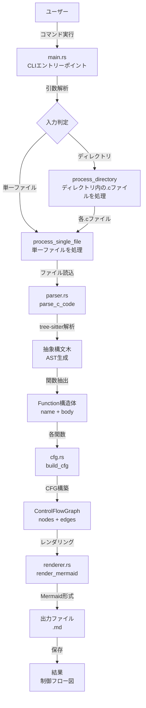
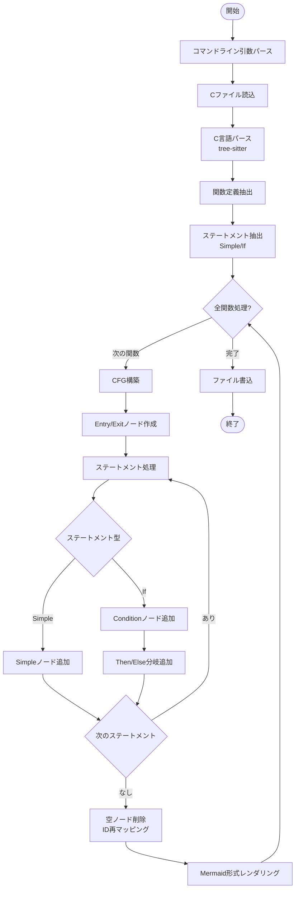
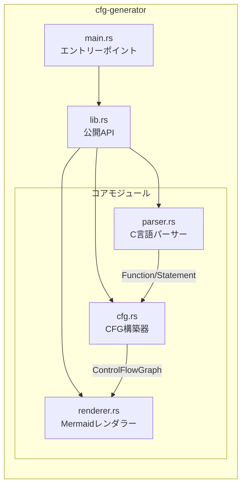
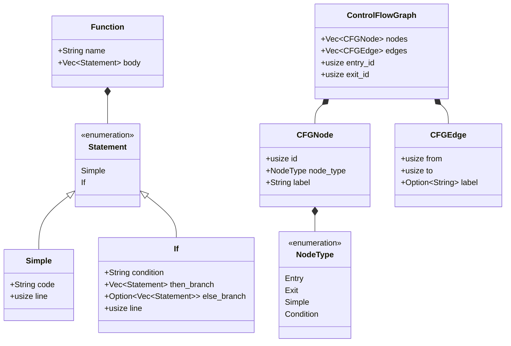

# vFlow Architecture

## プロジェクト概要
vFlowは、C言語のソースコードから制御フロー図を自動生成するツールです。

## システムアーキテクチャ



## メイン処理フロー



## モジュール構成



## データ構造



## 処理の詳細

### 1. パース処理 (parser.rs)
- tree-sitterを使用してC言語の構文解析
- 関数定義を検出し、関数名と本体を抽出
- ステートメントをSimple（通常文）とIf（条件文）に分類

### 2. CFG構築 (cfg.rs)
- 関数ごとにEntry/Exitノードを作成
- ステートメントを順番に処理してノードとエッジを追加
- If文では条件ノードと分岐（true/false）を作成
- 空のノードを削除し、IDを最適化

### 3. レンダリング (renderer.rs)
- CFGをMermaid flowchart形式に変換
- ノード型に応じて形状を決定:
  - Entry/Exit: 丸角四角形 `([label])`
  - Condition: ひし形 `{label}`
  - Simple: 四角形 `[label]`
- エッジにラベル（true/false）を付加

## 入出力例

### 入力 (example.c)
```c
int max(int a, int b) {
    if (a > b) {
        return a;
    } else {
        return b;
    }
}
```

### 出力 (example.md)
- 関数maxの制御フローを表現するMermaidフローチャート
- Entry → Condition(a > b) → Then/Else分岐 → Exit

## 使用技術
- **言語**: Rust
- **パーサー**: tree-sitter (tree-sitter-c)
- **CLI**: clap
- **出力形式**: Mermaid flowchart
