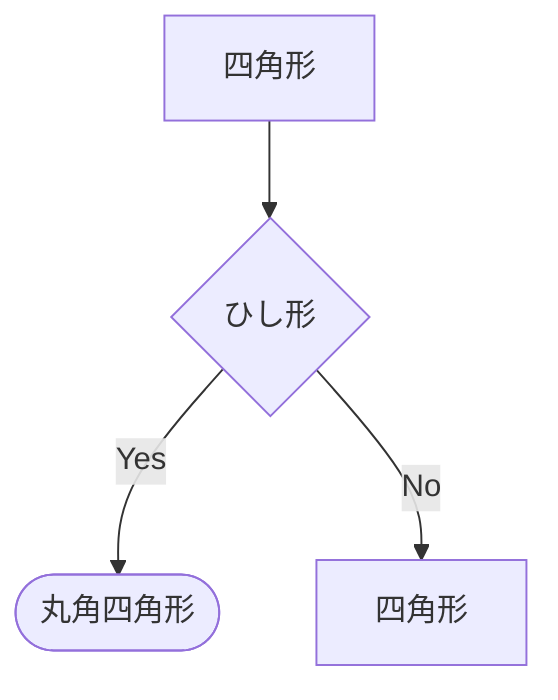

# vFlow ソースコード学習ガイド

このガイドでは、vFlowのソースコードを効率的に学習するための順序と、必要な基礎知識を説明します。

## 📚 必要な前提知識

### 1. プログラミング言語の基礎

#### Rust（このプロジェクトの実装言語）
- **基本文法**: 変数、関数、構造体、列挙型
- **所有権システム**: 借用（borrowing）、参照（&）、可変参照（&mut）
- **Result型とエラーハンドリング**: `Result<T, E>`、`?`演算子
- **トレイト**: 共通の振る舞いを定義する仕組み
- **モジュールシステム**: `mod`, `pub`, `use`

**学習リソース**:
- [The Rust Programming Language](https://doc.rust-lang.org/book/)（日本語版あり）
- [Rust By Example](https://doc.rust-lang.org/rust-by-example/)

#### C言語（解析対象の言語）
- **基本構文**: 変数宣言、関数、if文、ループ
- **制御構造**: if-else、while、for、switch
- プロジェクトを理解するには基本的な読解力があれば十分です

### 2. コンパイラ理論の基礎

#### 抽象構文木（AST: Abstract Syntax Tree）
プログラムの構文構造をツリー形式で表現したもの。

```
例: if (a > b) { return a; }

         if_statement
        /     |      \
   condition  then  else
      |        |
    a > b   return a
```

#### 構文解析（パーサー）
ソースコードをトークン（単語）に分割し、構文規則に従ってASTを構築する処理。

**tree-sitter**: 高速でインクリメンタルな構文解析器。
- 各言語ごとに文法が定義されている
- ノードの種類（kind）でコードの要素を識別
- バイト位置で元のソースコードの位置を保持

### 3. 制御フロー解析

#### 制御フローグラフ（CFG: Control Flow Graph）
プログラムの実行順序を表現したグラフ構造。

**構成要素**:
- **ノード（Node）**: プログラムの基本ブロック
  - Entry: 関数の開始点
  - Exit: 関数の終了点
  - Simple: 通常の処理（代入、関数呼び出しなど）
  - Condition: 分岐条件（ifの条件式など）

- **エッジ（Edge）**: ノード間の制御の流れ
  - 無条件エッジ: 常に次のノードへ進む
  - 条件付きエッジ: true/falseでラベル付けされた分岐

**例**:
```c
int max(int a, int b) {
    if (a > b) {
        return a;
    } else {
        return b;
    }
}
```

対応するCFG:
```
START → [a > b]? → (true) → [return a] → END
              ↓
           (false)
              ↓
         [return b] → END
```

### 4. Mermaid記法
テキストベースでダイアグラムを描画するツール。

**基本構文**:


## 🗺️ 推奨される学習順序

### ステップ1: 全体像の把握（10分）

#### 1-1. READMEを読む
`/Users/morihibiki/oss/vFlow/README.md`

プロジェクトの目的と使い方を理解します。

#### 1-2. architecture.mdを読む
`/Users/morihibiki/oss/vFlow/architecture.md`

システム全体のアーキテクチャと処理フローを把握します。

#### 1-3. 実際に動かしてみる
```bash
# ビルド
cargo build --release

# 実行
./target/release/cfg-generator

# 出力を確認
ls output/
cat output/example.md
```

実際の入力（example_code/*.c）と出力（output/*.md）を見比べることで、
このツールが何をするのかを体感できます。

### ステップ2: エントリーポイントから追う（15分）

#### 2-1. main.rs を読む
`cfg-generator/src/main.rs`

**読むべきポイント**:
- `Cli`構造体（7-18行目）: コマンドライン引数の定義
- `main`関数（20-40行目）: 処理の分岐ロジック
  - ディレクトリか単一ファイルか判定
- `process_directory`（42-64行目）: 複数ファイルの処理
- `process_single_file`（66-87行目）: 単一ファイルの処理フロー

**重要な流れ**:
```rust
parse_c_code(&source)  // ソースコード → 関数リスト
↓
build_cfg(func)        // 関数 → CFG
↓
render_mermaid(&cfg)   // CFG → Mermaid形式
```

この3つの関数が核心部分です。

#### 2-2. lib.rs を読む
`cfg-generator/src/lib.rs`

各モジュールの公開APIを確認します。わずか7行ですが、
このプロジェクトの構造を理解する上で重要です。

### ステップ3: パーサーを理解する（30分）

#### 3-1. parser.rs の構造体を読む
`cfg-generator/src/parser.rs`（1-21行目）

**重要な構造体**:
- `Function`: 関数の表現（名前 + 本体）
- `Statement`: C言語の文の表現
  - `Simple`: 通常の文（変数宣言、代入、return等）
  - `If`: if文（条件 + then分岐 + else分岐）

#### 3-2. parse_c_code を読む
`parser.rs:23-45`

**処理の流れ**:
1. tree-sitterのパーサーを初期化
2. C言語の文法をロード
3. ソースコードをパース → ASTを取得
4. ASTのルートノードから関数定義を探す
5. 各関数を`parse_function`で処理

**重要な概念**:
- `Node`: tree-sitterのASTノード
- `kind()`: ノードの種類（"function_definition"等）
- `children()`: 子ノードの走査

#### 3-3. parse_function と関連関数を読む
`parser.rs:47-76`

関数名の抽出方法と、ASTの走査方法を学びます。

**ポイント**:
- `child_by_field_name`: 特定のフィールド（関数名、本体等）を取得
- 再帰的なASTの探索パターン

#### 3-4. parse_compound_statement を読む
`parser.rs:78-106`

関数本体（複合文）からステートメントを抽出する処理。

**チェックポイント**:
- どのように文の種類を判定しているか（`child.kind()`）
- if文と通常の文をどう区別しているか
- 再帰的なネストしたブロックの処理

#### 3-5. parse_if_statement を読む
`parser.rs:108-170`

if文の解析処理。このプロジェクトで最も複雑な部分の一つ。

**難しいポイント**:
- 括弧付き条件式の処理（109-122行目）
- else if の処理（134-162行目）
- tree-sitterのノード構造の理解が必要

**学習のコツ**:
まずは全体の流れを理解し、細かい処理は後回しでOKです。

### ステップ4: CFG構築を理解する（45分）

#### 4-1. cfg.rs の構造体を読む
`cfg-generator/src/cfg.rs`（1-38行目）

**重要な構造体**:
- `CFGNode`: グラフのノード（id、タイプ、ラベル）
- `NodeType`: ノードの種類を表す列挙型
- `CFGEdge`: ノード間のエッジ（from、to、ラベル）
- `ControlFlowGraph`: 完成したCFG（ノード集合 + エッジ集合）
- `CFGBuilder`: CFG構築用のビルダー

#### 4-2. build_cfg を読む
`cfg.rs:212-223`

公開API。この関数がCFG構築の入口です。

**処理の流れ**:
1. ビルダーを初期化
2. Entry/Exitノードを作成
3. 関数本体のステートメントを処理
4. ビルダーからCFGを構築（最適化含む）

#### 4-3. build_statements を読む
`cfg.rs:113-167`

ステートメントのリストをCFGに変換する核心部分。

**重要な概念**:
- `entry`: 現在のステートメント群の開始ノード
- `exit`: 現在のステートメント群の終了ノード
- `current`: 現在処理中のノード

**処理パターン**:
```rust
// Simple文の場合
current → [新しいノード] → current を更新

// If文の場合
current → [条件ノード] → then分岐
                      ↓
                   else分岐
                      ↓
両方の分岐が [合流点] → current を更新
```

**読むときのコツ**:
- まず`Statement::Simple`の処理（122-132行目）を理解
- 次に`Statement::If`の処理（133-164行目）を読む
- 紙に図を描きながら読むと理解しやすい

#### 4-4. build_statements_with_edge を読む
`cfg.rs:60-111`

エッジにラベルを付けながらステートメントを処理する関数。

**用途**:
- if文のthen/else分岐の処理
- 最初のエッジに"true"/"false"ラベルを付ける

**build_statementsとの違い**:
- 最初のエッジだけ`edge_label`を付ける
- それ以降は`build_statements`と同じロジック

#### 4-5. build（最適化処理）を読む
`cfg.rs:169-209`

空のノードを削除し、IDを再割り当てする最適化処理。

**なぜ必要か**:
- if文の合流点として作成した空のノードを削除
- 見やすいCFGを生成するため

**処理の流れ**:
1. 空のSimpleノードを除外しながら新しいノードリストを作成
2. 古いID → 新しいIDのマッピングを作成
3. エッジのIDを再マッピング

### ステップ5: レンダリングを理解する（15分）

#### 5-1. renderer.rs 全体を読む
`cfg-generator/src/renderer.rs`

他のモジュールに比べて短く、理解しやすいです。

#### 5-2. render_mermaid を読む
`renderer.rs:3-39`

CFGをMermaid flowchart形式の文字列に変換します。

**処理の流れ**:
1. Mermaidのヘッダーを出力
2. 各ノードを適切な形状で描画
   - Entry/Exit: `([label])`
   - Condition: `{label}`
   - Simple: `[label]`
3. 各エッジを矢印で描画
   - ラベルありの場合: `A -->|label| B`
   - ラベルなしの場合: `A --> B`
4. 末尾のマークダウンコードブロック終了

#### 5-3. escape_mermaid を読む
`renderer.rs:41-56`

Mermaidの特殊文字をエスケープする処理。

**重要なポイント**:
- セミコロンや括弧など特殊文字を含む場合は引用符で囲む
- これがないとMermaidの構文エラーになる

### ステップ6: 実際に動かしながら理解を深める（30分以上）

#### 6-1. デバッグ出力を追加してみる

例えば、`parser.rs`の`parse_function`に出力を追加:

```rust
fn parse_function(node: Node, source: &str) -> Option<Function> {
    let name = get_function_name(node, source)?;
    println!("Parsing function: {}", name);  // 追加

    let body_node = node.child_by_field_name("body")?;
    let body = parse_compound_statement(body_node, source);
    println!("  Found {} statements", body.len());  // 追加

    Some(Function { name, body })
}
```

再ビルドして実行し、どのように処理が進むか観察します。

#### 6-2. 簡単なC言語ファイルを作成して試す

```c
// example_code/simple.c
int test(int x) {
    if (x > 0) {
        return 1;
    }
    return 0;
}
```

```bash
cargo build --release
./target/release/cfg-generator example_code/simple.c -o output/simple.md
cat output/simple.md
```

出力されたMermaid図を確認し、期待通りのCFGが生成されているか確認します。

#### 6-3. より複雑な例を試す

```c
// example_code/complex.c
int classify(int x) {
    if (x > 0) {
        if (x > 10) {
            return 2;
        }
        return 1;
    } else {
        return -1;
    }
}
```

ネストしたif文がどのようにCFGに変換されるか観察します。

#### 6-4. テストを読む
`cfg-generator/tests/integration_test.rs`

実際の入出力例を確認できます。

#### 6-5. テストを実行する

```bash
cargo test
```

全てのテストが通ることを確認し、期待される動作を理解します。

## 🎯 理解度チェック

各ステップで以下の質問に答えられるか確認しましょう。

### パーサー編
- [ ] tree-sitterで関数定義を見つける方法は？
- [ ] if文の条件式、then分岐、else分岐はどう抽出される？
- [ ] `Statement`列挙型の2つのバリアントは何？

### CFG構築編
- [ ] Entry/Exitノードは何のため？
- [ ] if文で合流点（merge_id）が必要な理由は？
- [ ] `build_statements`と`build_statements_with_edge`の違いは？
- [ ] なぜ空のノードを削除する必要がある？

### レンダリング編
- [ ] Mermaidでひし形を描画する記法は？
- [ ] エッジにラベルを付ける記法は？

### 全体編
- [ ] C言語ソースコードからMermaid図が生成されるまでの流れを説明できる？
- [ ] このツールの制約や制限は何？（例：ループ文は未対応）

## 🚀 次のステップ

このプロジェクトを理解したら、以下の拡張にチャレンジしてみましょう：

### 初級
1. **コメントの追加**: より詳しいコメントを追加して理解を深める
2. **エラーメッセージの改善**: より分かりやすいエラーメッセージに変更
3. **新しいテストケースの追加**: edge caseをテストする

### 中級
4. **while/forループのサポート**: ループ文にも対応する
5. **switch文のサポート**: switch-case文を処理する
6. **関数呼び出しの追跡**: 呼び出し先の関数もグラフに含める

### 上級
7. **他言語のサポート**: PythonやJavaScriptにも対応
8. **対話的なビジュアライザー**: WebベースのUIを作成
9. **データフロー解析**: 変数の値の流れも解析する

## 📖 参考資料

### Rust
- [The Rust Programming Language](https://doc.rust-lang.org/book/)
- [Rust API Guidelines](https://rust-lang.github.io/api-guidelines/)

### tree-sitter
- [tree-sitter公式サイト](https://tree-sitter.github.io/tree-sitter/)
- [tree-sitter-c](https://github.com/tree-sitter/tree-sitter-c)

### コンパイラ理論
- [Compilers: Principles, Techniques, and Tools (ドラゴンブック)](https://www.amazon.co.jp/dp/B009TGD06W/)
- [エンジニアのための理論でわかるデザイン入門](https://www.amazon.co.jp/dp/4297107139/)

### 制御フロー解析
- [Control-flow graph (Wikipedia)](https://en.wikipedia.org/wiki/Control-flow_graph)
- [Static Program Analysis (Lecture Notes)](https://cs.au.dk/~amoeller/spa/)

## 💡 学習のコツ

1. **小さく始める**: 一度に全部理解しようとせず、1つずつ着実に
2. **手を動かす**: 読むだけでなく、実際にコードを変更して実験
3. **図を描く**: CFGやASTを紙に描きながら理解を深める
4. **質問する**: 分からないことは遠慮なく質問（GitHubのIssueやDiscussionsを活用）
5. **休憩を取る**: 疲れたら休憩。焦らず自分のペースで

頑張ってください！
